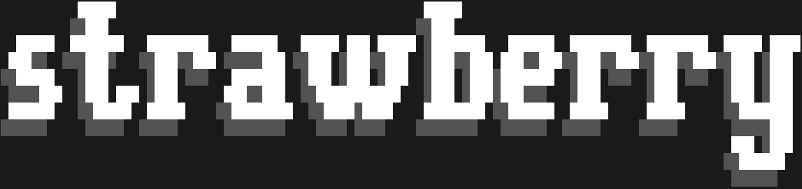
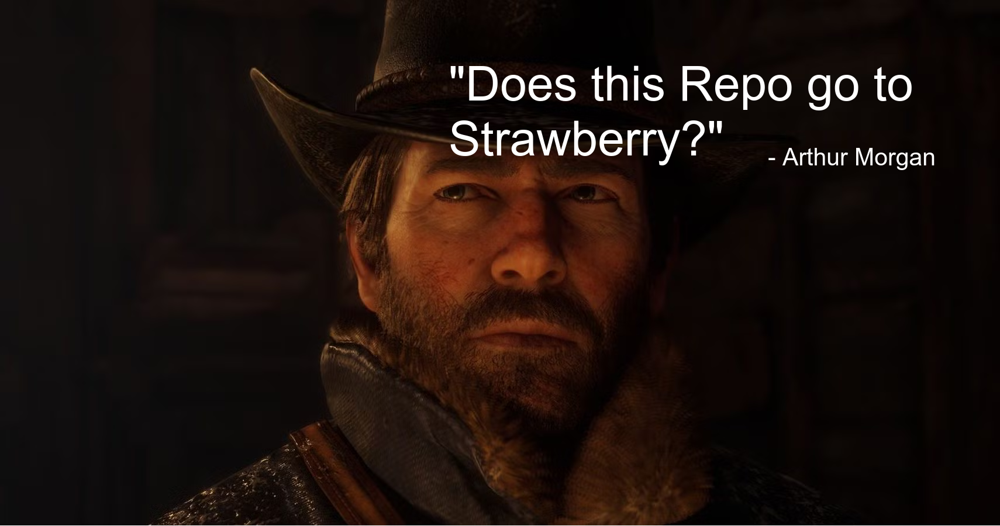

# Strawberry: Is strawberry a fruit or a vegetable?



Strawberry is primarily an early-stage neural network architecture built on top of Andrej Karpathy's [nanoGPT](https://github.com/karpathy/nanoGPT) project. Currently not much is implemented, however everything inside this repository is enough to train AI models of various sizes.

Strawberry brings several improvements over the standard GPT-2 architecture, such as:
1. Shared stack of layers across recursion steps inspired from Google's Mixture of Recursions [[paper](https://arxiv.org/pdf/2507.10524)]
2. MoE Swiglu FFN & attention mechanism [[paper](https://arxiv.org/pdf/1701.06538)]
3. Apple's Attention Free Transformer [[paper](https://arxiv.org/pdf/2105.14103)]
4. Swiglu based FFN [[paper](https://arxiv.org/pdf/2002.05202)]
5. Modernized architecture: Rotary embeddings and QK-Norm
6. My custom `The Expert Abundance` attention mechanism
7. My custom `Retention Mechanism` architecture
8. Shared embedding weights

## The Expert Abundance
MoE-powered attention mechanism & Swiglu MoE-FFN.

- Derive **QKV**, **Swiglu** & **Output projection** weights by the Retention Mechanism's **Update Rule** *(given below)*

```
Q, K, V     -> Local, Token-level MoE Scaled Dot Product Attention              -> Y
Y           -> Concatenate all local mixture of attention parts                 -> Y
Y           -> Swiglu mini-ffn                                                  -> Y
Y           -> X + out(Y)                                                       -> Y
```

> [!NOTE]
> As of now Token-level MoE has not been implemented in The Expert Abundance.

## Retention Mechanism
Derive **QKV**, **Swiglu** & **out projection** weights using the given input.

### How it works
1. Produce
- Has 3 trainable linear layers. Original (`w_O`), adjust (`w_A`) & transform weights (`w_T`).
- Original weights acts similar to Query weights in attention mechanism, it tells the model about the information original input (`X`) had.
- Adjust weights tell the model how to adjust the information presented by `Xw_O`.
- Transform weights tell the model to transform the adjusted information in a way which can be used by attention and mini-swiglu in attention.
- Original & Adjust weights shares the same shape `(C, C)`; where `C` is embedding dimension of the model.
- Transform weights has a shape `(C, 5*D + C)`; where `D` is QKV dimension.
- `(C, 5*D+C)` can be splitted into 3 weights; **w_qkv shape**: `(C, 3*D)`, **w_swiglu shape**: `(D, 2*C)` & **w_out shape**: `(C, C)`

2. Initialization
- We have **w_attn_qkv**, **w_attn_swiglu** & **w_attn_out**. QKV, Swiglu & out proj parameters of the attention mechanism.
- We also have **w_qkv**, **w_swiglu** & **w_out**. QKV, Swiglu & out proj parameters derived from the retention mechanism.
- We create 2 variables Current (`wC`) & Transformed (`wT`).
- Then we set them as the following `wC = tuple(w_attn_qkv, w_attn_swiglu, w_attn_out)` & `wT = tuple(w_qkv, w_swiglu, w_out)`.

3. Update rule
- First we always perform attention on `wC`.
- Then we update `wC` & `wT` in way given below:

```python
# update QKV, Swiglu and output projection weights
w_qkv = wT[0] * F.silu(wC[0]) + wC[0]
w_swiglu = wT[1] * F.silu(wC[1]) + wC[1]
w_out = wT[2] * F.silu(wC[2]) + wC[2]

# normalize QKV, Swiglu and output projection weights
w_qkv = self.w_norm(w_qkv, self.n_embd)
w_swiglu = self.w_norm(w_swiglu, self.n_qkv)
w_out = self.w_norm(w_out, self.n_embd)

# swap
wT, wC = wC, (w_qkv, w_swiglu, w_out)
```

- Then we again perform the attention on new `wC` and this cycle continues.

## Getting Started
<ins>**1. Downloading the repository:**</ins>

Start by cloning the repository with `git clone https://github.com/SrijanSriv211/Strawberry`.

<ins>**2. Configuring the hyperparameters:**</ins>

The configuration object can be found in `train.py`, which can also be copy-pasted into a separate `.json` file

```json
{
	"dataset": {
		"data_division": 0.8, // 80% train data, 20% val data
		"load_from_file": true, // if false it'll try to load all files in the given path (assuming the given path in that case is a directory)
		"path": "data/webtext.bin"
	},
	"checkpoints": {
		"path": "bin/ck",
		"interval": 2000,
		"create_checkpoints": true
	},
	"model_hyperparams": {
		"vocab_size": 8192,
		"block_size": 256,
		"r_layer": 2, // number of "virtual" layers the retention mechanism will work with
		"n_layer": 2, // number of layers you want
		"n_head": 4,
		"n_embd": 64,
		"n_qkv": 256,
		"n_ffn": 256
	},
	"optimizer_hyperparams": {
		"eps": 1e-10,
		"beta1": 0.9,
		"beta2": 0.95,
		"weight_decay": 1e-1,
		"use_muon": false, // for the muon optimizer, it's code is present in `optimizer.py`
		"momentum": 0.95 // muon optimizer's hyperparameter
	},
	"model_path": "bin/air.strawberry", // model's save path after training
	"encoder_path": "bin/cl8k.bin", // load encoder from the given path
	"init_from": "scratch", // "scratch" -> init a fresh model and train; "<model_path>,pretrained" -> load pre-trained model from path `<model_path>` and train
	"seed": "auto",

	"gradient_accumulation_steps": 1,
	"batch_size": 4,

	"max_iters": 50000,
	"eval_interval": 2000,
	"log_interval": 200,
	"eval_iters": 200,

	"decay_lr": true,
	"lr_decay_iters": 50000,
	"learning_rate": 3e-3,
	"cooldown_frac": 0.4,
	"warmup_iters": 2000,
	"min_lr": 3e-4
}
```

## Citation

```
@software{Strawberry,
    author={Srijan Srivastava},
    title={Strawberry},
    url={https://github.com/SrijanSriv211/Strawberry},
    version={0.1.0},
    year = {2026}
}
```


