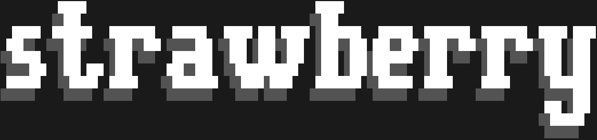

# Strawberry: Is strawberry a fruit or a vegetable?



Strawberry is primarily an early-stage neural network architecture built on top of Andrej Karpathy's [nanoGPT](https://github.com/karpathy/nanoGPT) project. Currently not much is implemented, however everything inside this repository is enough to train AI models of various sizes.

Strawberry brings several improvements over the standard GPT-2 architecture, such as:
1. Modernized architecture: Rotary embeddings and QK-Norm
2. Silia (Silu in Attention), replace FFN with attention
3. Shared embedding weights

### Architecture Design
```
Input tokens
    |
[Token Embedding]
    |
[Strawberry Block xN:]
    |--- Scaled Dot Product Attention
    |    |--- Rotary Positional Embeddings
    |    |--- QK Norm
    |    |--- Multi-Headed Attention
    |--- SiLU non-linearity
    |--- Scaled Dot Product Attention
    |    |--- Rotary Positional Embeddings
    |    |--- QK Norm
    |    |--- Multi-Headed Attention
    |
[Output Projection (weight-tied)]
    |
Next token logits
```

## Citation

```
@software{Strawberry,
    author={Srijan Srivastava},
    title={Strawberry},
    url={https://github.com/SrijanSriv211/Strawberry},
    version={0.1.0},
    year = {2026}
}
```


